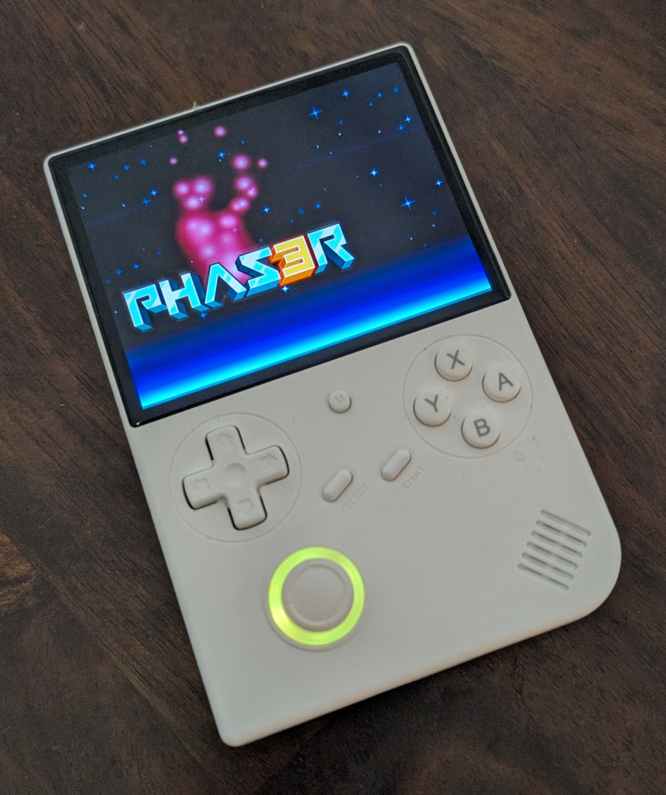

# @monteslu/jsgamelauncher

A compatibily layer for Javscript games to run WITHOUT a browser or electron using standard web APIs.

The goal is to run games on cheap retro devices that will also run in browsers without any changes.

## Browser APIs available

- canvas
- gamepads
- keyboard
- mouse
- localStorage

[sample games / demos](https://github.com/monteslu/jsgames)

## Running on a desktop OS

- use at least node 22
- clone this repo
- cd to this directory
- npm install
- `node index -rom /full/path/to/game.js` (clone sample game at https://github.com/monteslu/jsgames/tuxgame/game.js)

## installing on knulli (custom linux for Anbernic retro handhelds)

- make sure wifi is turned on for your knulli device
- `ssh root@<myKnullidevice>` (default password: linux, default device name : KNULLI, use IP from device if name fails)
- `touch ~/.bash_profile`
- `curl -o- https://raw.githubusercontent.com/nvm-sh/nvm/v0.40.0/install.sh | bash`
- `source ./.bash_profile`
- `nvm install 22`
- if you did npm install in jsgameslauncher on your local machine, delete the node_modules directory
- copy this directory (jsgameslauncher) to `/userdata/system` on the knulli device (using the SMB share at \\<myKnullidevice>\share\system, or SFTP, etc)
- `chmod +x ~/jsgameslauncher/knulli/run.sh`
- `cp ~/jsgameslauncher/knulli/es_systems_jsgames.cfg ~/configs/emulationstation/`
- `mkdir /userdata/roms/jsgames`
- `cd ~/jsgameslauncher`
- `npm install`
- copy any "roms" to jsgames (can do this with samba, ftp, or onto the SD card, note that if you connected via Samba, you might have to force a refresh of the Samba share)
- restart the system
- ENJOY!
